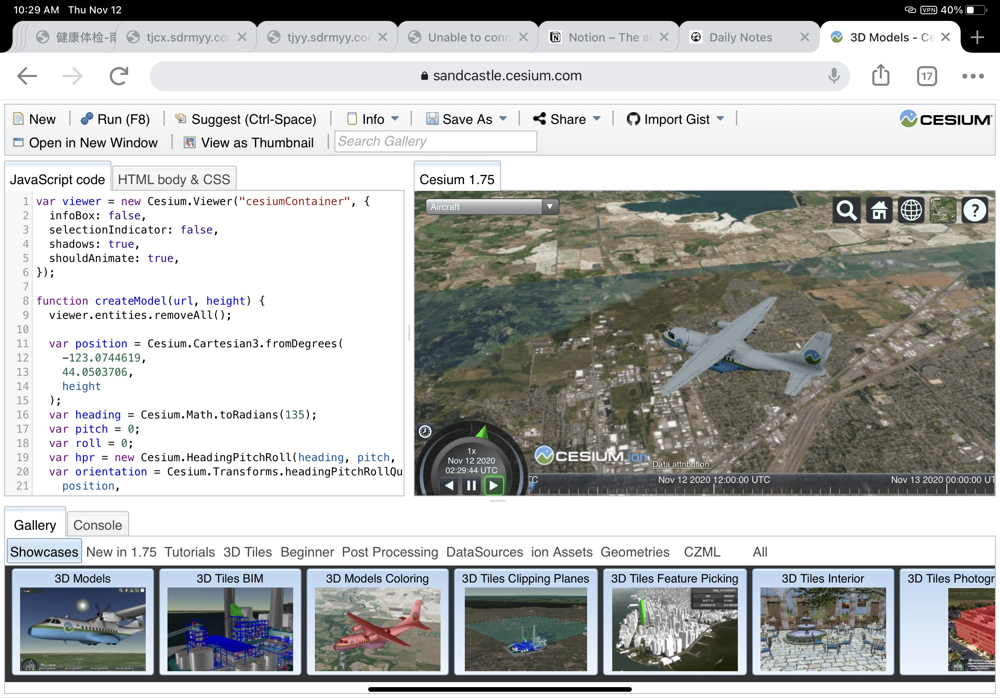

# cesium-implement-demo
Use React &amp; CesiumJS to create a showcase. It contains a drone flying above terrain. 

# detail

**step 1**

Fork 该项目到你的个人账户下面，并开始建立开发分支进行开发。

**step 2**

阅读 [CesiumJS](https://cesium.com/) 的官方网站，并参考下面图片效果。利用 React 重构相关代码，在 Cesium 引擎下实现渲染无人机在半空悬停的效果。

**step 3**

- 场景设置到：Cesium.Cartesian3.fromDegrees(-74.019, 40.6912, 750) 纽约曼哈顿
- 利用 Cesium 中 OpenStreetMap 的 API，创建建模模型，并找到「世界贸易中心一号楼」
- 找到 https://sandcastle.cesium.com/?src=3D%20Models.html 中无人机的 3D model，并在自己的实例中进行加载。
- 加载无人机模型后，实现无人机以圆形航线，模拟环绕「世界贸易中心一号楼」进行拍摄运动的动画（无人机机头始终对着大楼中心点），飞行高度可任意设置，但运动过程中不能够与其他建筑物发生碰撞

**step 4**

项目完成后，把代码推到 Github 上面来。并向本账户发起 merge request，并在相关描述中说明，实现过程。如果遇到相关困难的，也可以说明相关的困难。

最终考核，我们看 Github 上面的项目。
